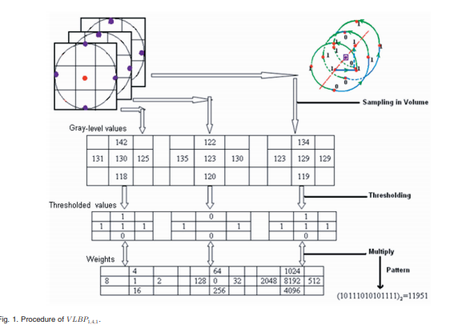
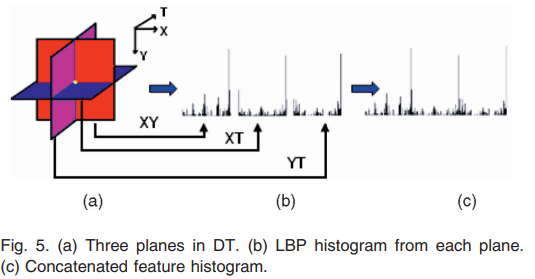
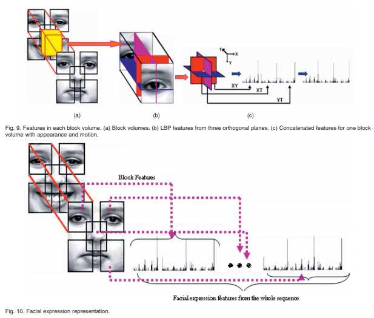
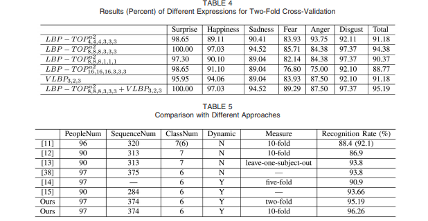

# Dynamic Texture Recognition Using Local Binary Patterns with an Application to Facial Expressions

### Authors
* Guoying Zhao
* Matti Pietikainen

### Principal topics
* FER on video
* Classic machine learning
* two extensions of LBP to volumen features
* VLBP and LBP-TOP

### Dataset
* CK+

# Resume
The authors propose two new extensions of LBP features extractions

| VLBP |
| :------------- |
|  |

| LBP-TOP |
| :------------- |
|  |
|  |

### Experiments

| CK |
| :------------- |
|  |
