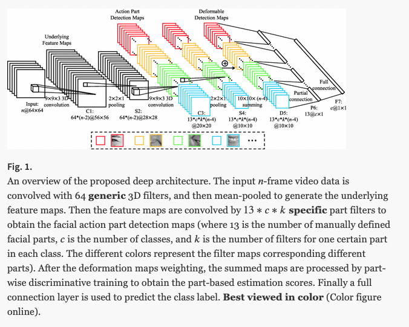
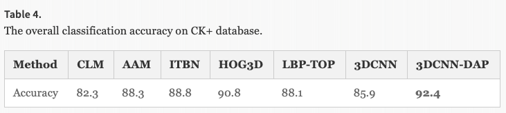
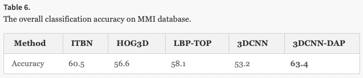
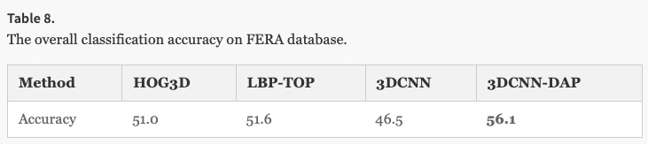

# Deeply Learning Deformable Facial Action Parts Model for Dynamic Expression Analysis

### Authors
* Mengyi Liu
* Shaoxin Li
* Shiguang Shan
* Ruiping Wang
* Xilin Chen

### Principal Topics
* Fer on videos
* 3DCNN and 3DCNN-DAP (Using idea of deformable action parts model)

# Datasets
* CK+
* MMI
* FERA

# Resume
THe authors create a baseline using 3DCNN proposed in other paper for action recognition, now using in FER problem. After create a deformable facial  action parts model imitating the deformable part model in NN.

| Architecture | Deformable filters |
| :------------- | :------------- |
|   |  |

# Results

| CK | MMI | Fera |
| :------------- | :------------- | :------------- |
|  |  |  |
