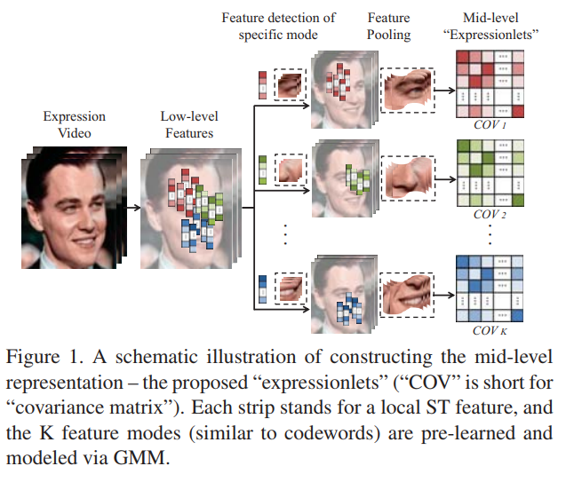
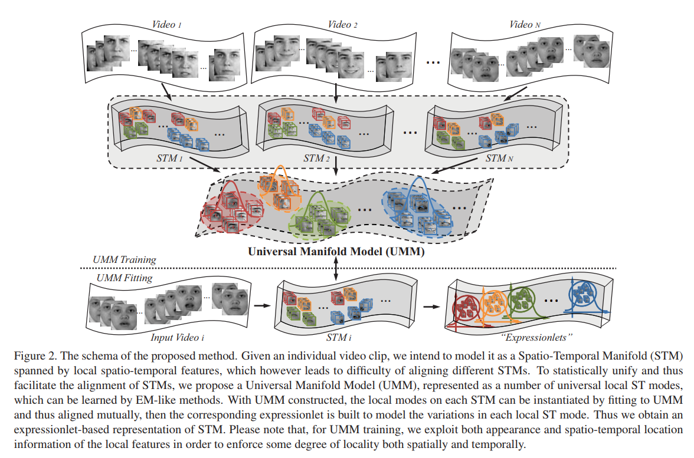
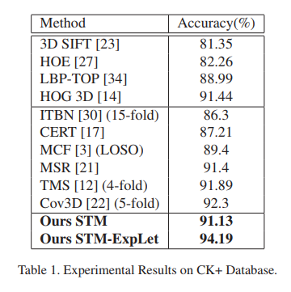
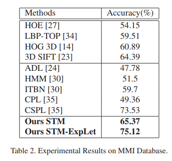
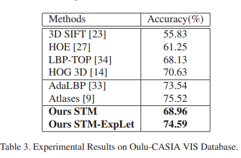
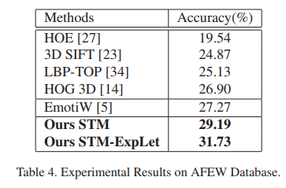

# Learning Expressionlets on Spatio-Temporal Manifold for Dynamic Facial Expression Recognition

### Authors
* Mengyi Liu
* Shiguang Shan
* Ruiping Wang
* Xilin Chen

# Principal Topics
* Fer on Video
* Classic ML
* Gaussian mixture models

### Datasets

# Resume
The authors create a pipeline with features extracted from each frame and integrate that features in low and mid level for spatio temporal representation. Finally the Gaussian mixture models are created to try create abstract representation of each expression based on low/mid level features extracted.

| Features | Model |
| :------------- | :------------- |
|  |  |

# Results
| CK | MMI | OULU | AFEW |
| :------------- | :------------- | :------------- | :------------- |
|  |  |  |  |
