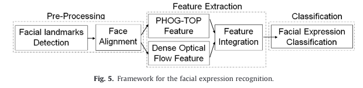
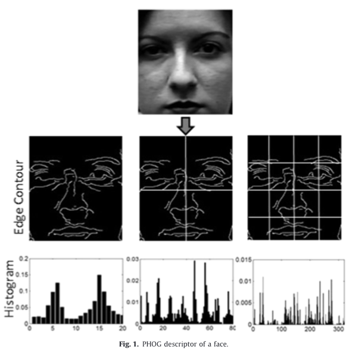
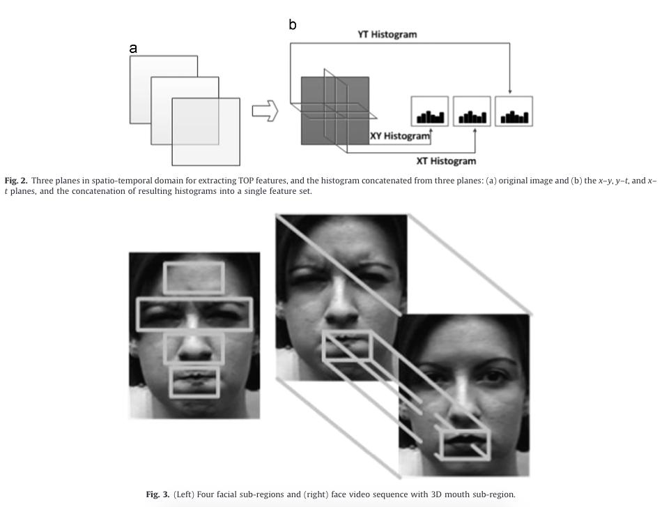
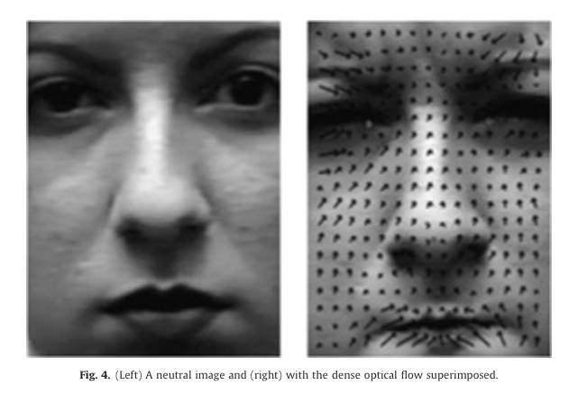
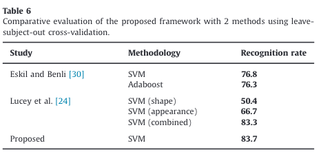
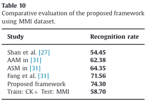

# A spatial-temporal framework based on histogram of gradientsand opticalflow for facial expression recognition in video sequences

### authors
* Xijian Fan
* Tardi Tjahjadi

### Principal Topics
* Fer on videos using spatial pyramid histogram of gradients
* Merge the features extracted by SPHOG with optical flow

# Datasets
* CK+
* MMI

# Resume
The authors create a hang-crafted feature extractor mixturing spatial-temporal features extracted by using SP_HOG in Tree orthogonal planes (SP-HOG-TOP) and extracted by optical optical flow

| Pipeline |
| :------------- |
|  |

| SP HOG | HOG-TOP | Optical flow |
| :------------- | :------------- | :------------- |
|  |  |  |

### Results

| CK | MMI |
| :------------- | :------------- |
|  |  |
