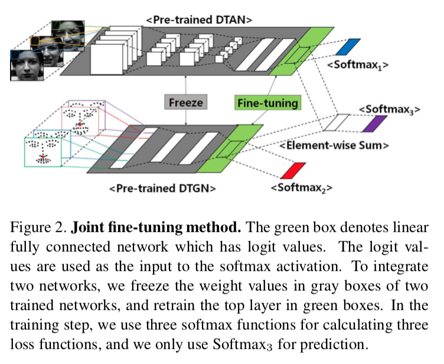
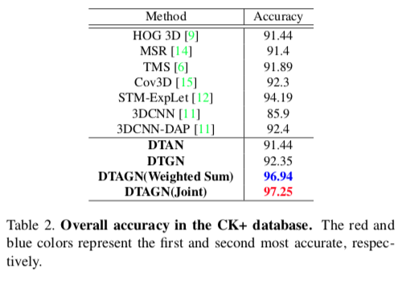
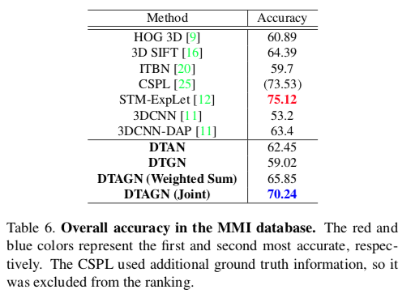
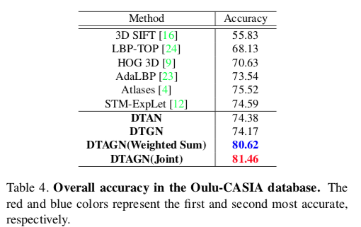

# Joint Fine-Tuning in Deep Neural Networks for Facial Expression Recognition

### authors
* Heechul Jung
* Sihaeng Lee
* Junho Yim
* Sunjeong Park
* Junmo Kim

### Principal Topics
* Fer on Videos using two NN and joint for classification
* 10 fold
* Geometric and appearance deep learning feature extractor

### Datasets
* CK+
* MMI
* OULU

# Resume
The authors create two network DTAN (Deep temporal appearance network) and DTGN (Deep temporal appearance network) and joint the output of these networks for classify the FER problem on video creating DTAGN.
The DTAN is a CNN based network that have all frames of videos as a input concatenated in channel axis.
The DTGN is a Dense network that have as input the x,y points of landmakrs of each face in each frame.

| Architecture |
| :------------- |
|  |

### Results

| CK+ | MMI | OULU |
| :------------- | :------------- | :------------- |
|  |  |  |
