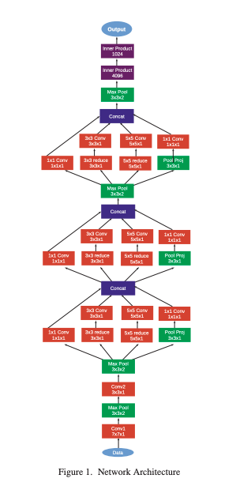

# Going Deeper in Facial Expression Recognition using Deep Neural Networks

### Authors
* Ali Mollahosseini
* David Chan
* Mohammad H. Mahoor

### Principal Topics
* Fer on images
* Inception net for FER

### Datasets
* CK+
* MMI
* DISFA
* FERA
* SFEW
* FER2013
* MultiPie

| Dataset |
| :------------- |
| |

## Resume
THe authors propose a Inception based architecture for FER on images

| Architecture |
| :------------- |
|  |

### results
| Clasification | Cross dataset |
| :------------- | :------------- |
|  |  |
