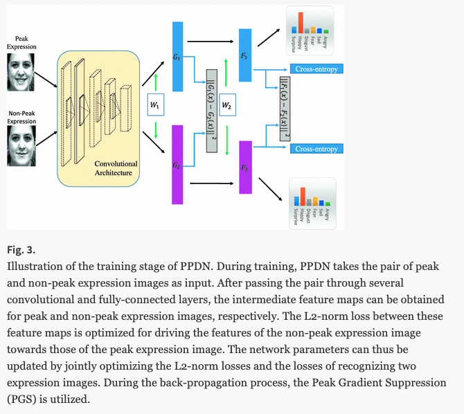
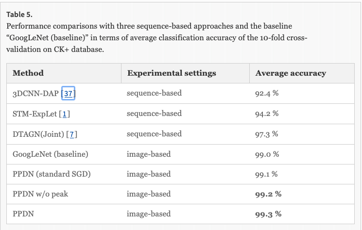
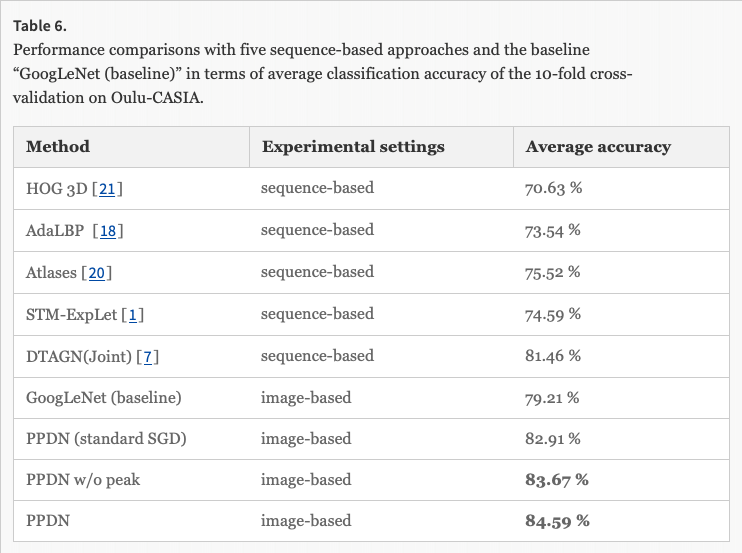

# Peak-Piloted Deep Network for Facial Expression Recognition

### Authors
* Xiangyun Zhao
* Xiaodan Liang
* Luoqi Liu
* Teng Li
* Yugang Han
* Nuno Vasconcelos
* Shuicheng Yan

### Principal Topics
* Fer on images
* CNN network with special way to train
* Two inputs to calculate lost (Easy and hard examples)

### Datasets
* CK+
* OULU

# Resume
The authors propose a CNN network with new way to train. The main idea is take two images (easy case and hard case, in apex and out apex) and get the features of two images also get the classification and try to regularize the network using the difference of features and classification of images.

| Architecture |
| :------------- |
|  |

### results

| CK | OULU |
| :------------- | :------------- |
|  |  |
