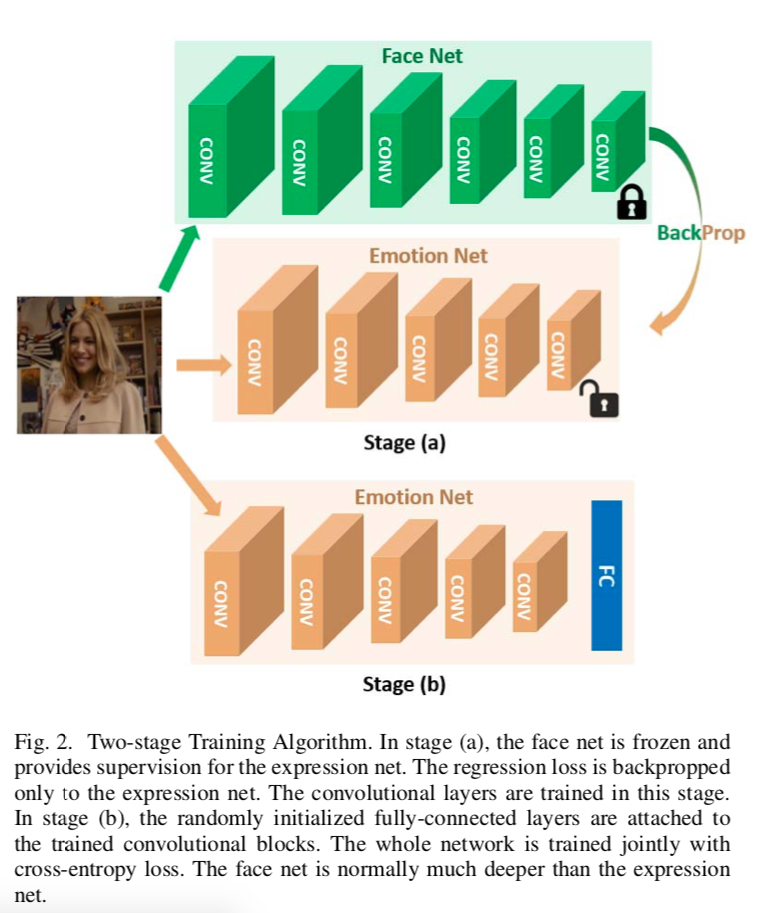
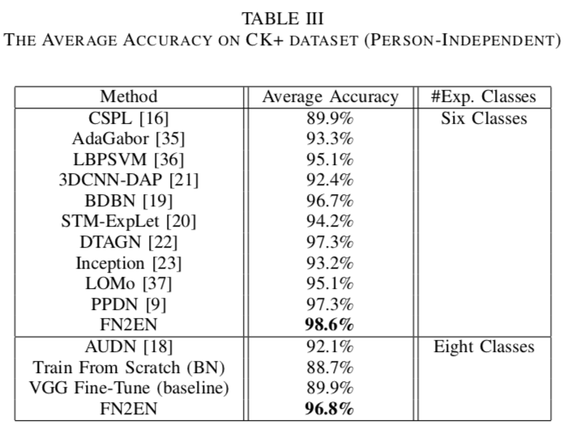
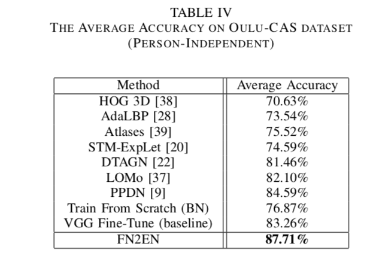
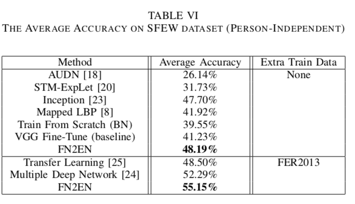
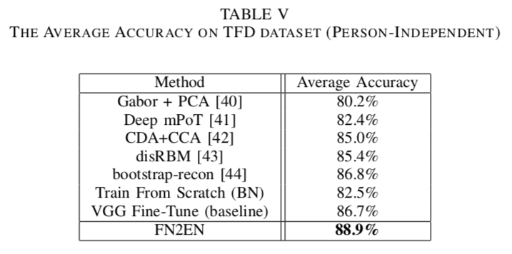

# FaceNet2ExpNet: Regularizing a Deep Face Recognition Net for Expression Recognition

### Authors
* Hui Ding
* Shaohua Kevin Zhou
* Rama Chellappa

# Principal Topics
* Fer on images
* Special Transfer learning from FaceNet
* Two stages training

### Datasets
* CK+
* OULU
* SFEW
* TDF

# Resume
The authors propose a two stage trainning method, the first stage is use a Conv2d Network and regugalize that network using pretrained FaceNet, the second stage is add FC layers with random initialization for train the clasification and make a pseudo-transfer learning
instead of classic transfer learning using the weigths as initialization

| Architecture |
| :------------- |
|  |

### Results
| CK | OULU | SFEW | TDF |
| :------------- | :------------- | :------------- | :------------- |
|  |  |  |  |
