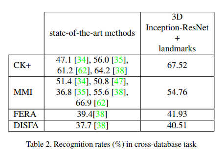

# Facial Expression Recognition Using Enhanced Deep 3D Convolutional Neural Networks

### Authors
* Behzad Hasani
* Mohammad H. Mahoor

# Principal Topics
* Inception-Resnet 3D + LSTM
* Fer on video
* Use landmarks to improve the prediction

### Datasets
* CK+
* MMI
* FERA
* DISFA

# Resume
The authors propose 3D Inception-Resnet version (based on previous paper with 2D), to solve FEr on video problem, They use input sequence of images and the sequence of landmarks to feed the network and get the prediction
Also the authors make a cross dataset comparison with good Results

| Pipeline | Architecture  |
| :------------- | :------------- |
|   |  |

#### Results
| Datasets | Cross dataset |
| :------------- | :------------- |
|  | |
