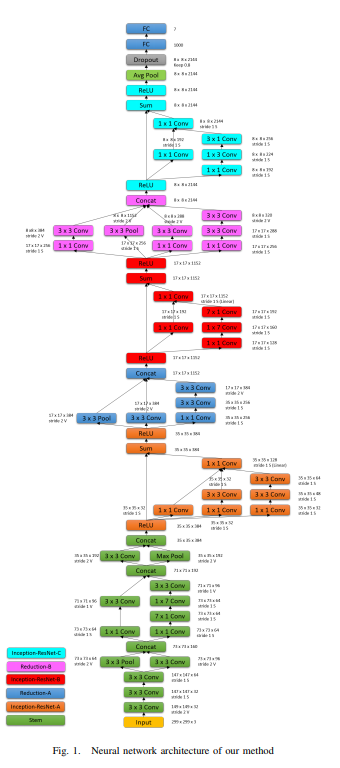
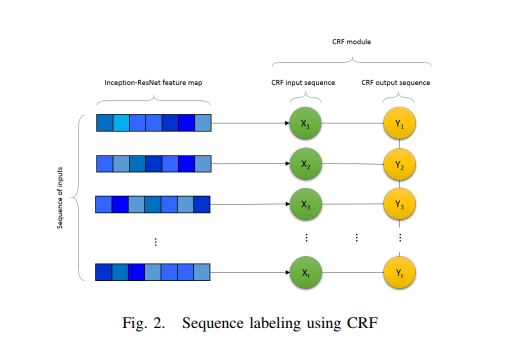
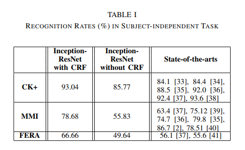
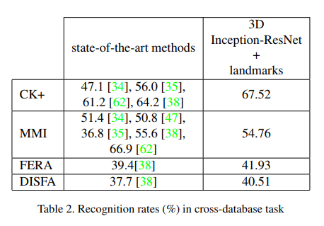

# Spatio-Temporal Facial Expression Recognition Using Convolutional Neural Networks and Conditional Random Fields

### Authors
* Behzad Hasani
* Mohammad H. Mahoor

# Principal Topics
* Fer on video ( N Frames)
* Inception-Resnet 2D + CRF
* Conditional random fields to work with time variable

### Datasets
* CK+
* MMI
* FERA

# Resume
The authors propose a network Inception-ResNet-2D + CRF to solve the problem of FER on video. Each image is feeded into Inception-ResNet to extract the features and the sequence is used by CRF to create the prediction.

| Arch | CRF |
| :------------- | :------------- |
|   |     |

#### Results

| Datasets | Cross dataset |
| :------------- | :------------- |
|  |  |
