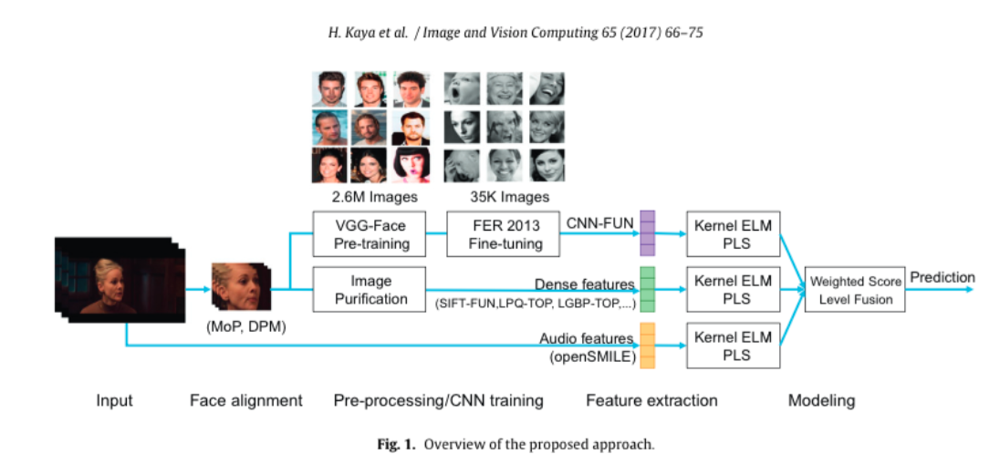
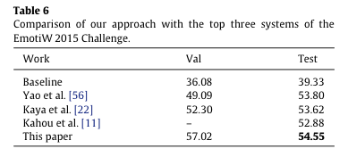
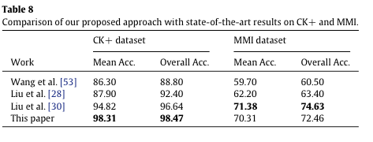

# Video-based emotion recognition in the wild using deep transfer learning and score fusion

### Authors
* Heysem Kayaa
* Furkan Gürpınarb
* Albert Ali Salah

# Principal Topics
* Fer on Video
* Hybrid method (hand-crafted feature extractor and deep learning)
* In the Wild

# Datasets
* CK+
* MMI
* AFEW

# Resume
The authors popose a hybrid model for fer in the wild, composed by a fusion of three different features extracted by different ways, the first is using CNN feature extractor, initializing with tranfer learning from facenet and using FERA2013 to augmented de data. The second features are extracted by classical hand-crafted feature extractors like lbp, ldp, etc. And the last is using the audio features from video.

| Pipeline |
| :------------- |
|  |

### Results

| AFEW | CK/MMI |
| :------------- | :------------- |
|  |  |
