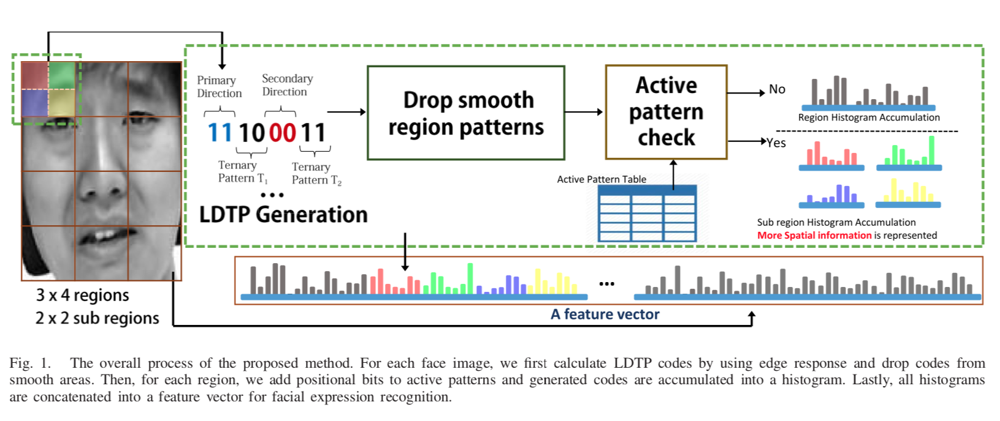
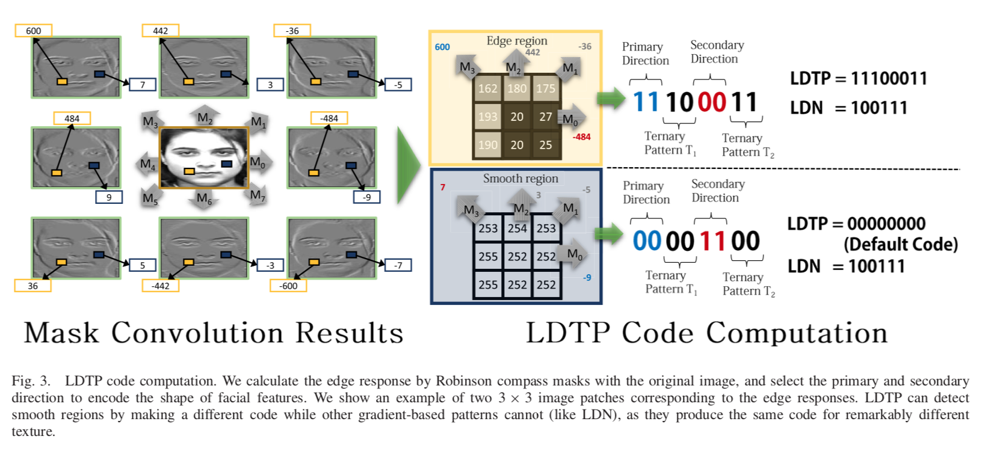
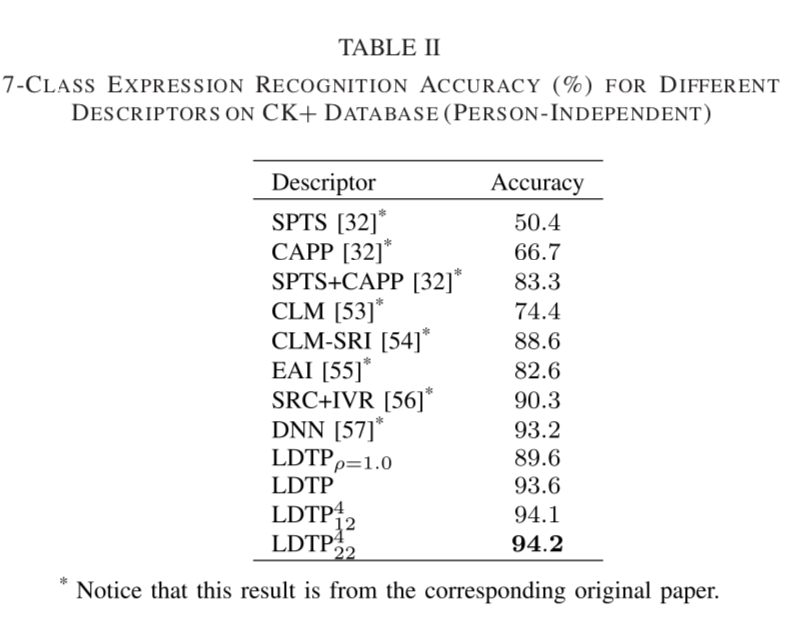

# Local Directional Ternary Pattern for Facial Expression Recognition

### Authors
* Byungyong Ryu
* Adín Ramírez Rivera
* Jaemyun Kim
* Oksam Chae

# Principal Topics
* Fer on images
* Directional patterns

# Datasets
* CK
* MMI
* BU3DFE
* FERA
* JAFFE

# Resume
The authors propose a new feature extractor based on local directional patterns but this case propose a ternary pattern creation

| Pipeline | Pipeline |
| :------------- | :------------- |
|  |  |

### Results

| Dataset | Result |
| :------------- | :------------- |
| CK+ |  |
| MMI |  |
| JAFFE |  |
| FERA |  |
| BU3DFE |  |
