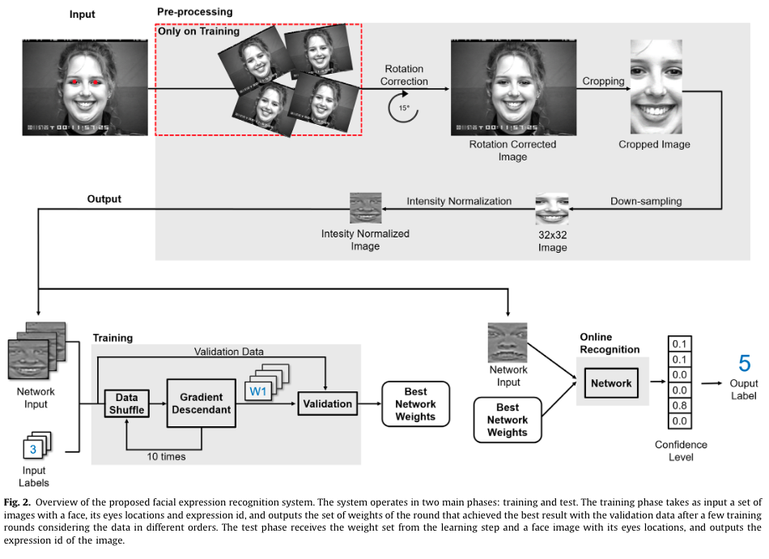
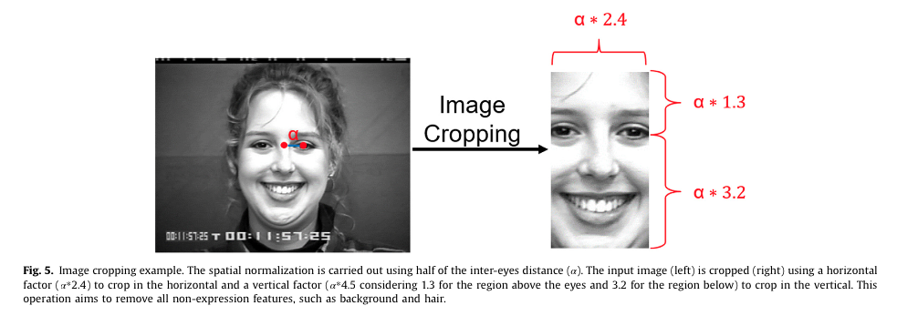
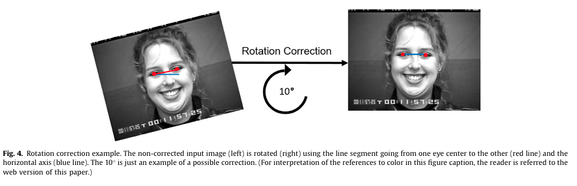
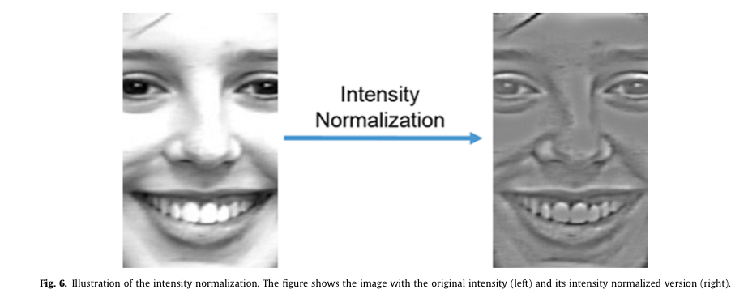
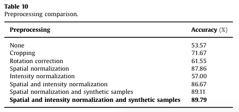
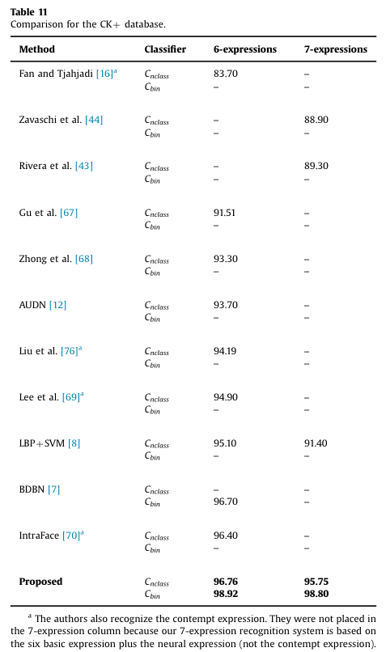
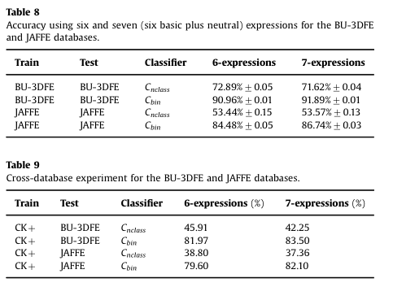

# Facial expression recognition with Convolutional Neural Networks:Coping with few data and the training sample order

### Authors
* André Teixeira Lopesa
* Edilson de Aguiarb
* Alberto F. De Souzaa
* Thiago Oliveira-Santos

# Principal Topics
* Fer on images
* Cross Datasets
* new data augmentation pipeline

# Datasets
* CK+
* JAFFE
* BU-3DFE

# Resume

The authors propose a new pipeline for data augmentation.

| Pipeline |
| :------------- |
|  |

| crop | rotation | normalization |
| :------------- | :------------- | :------------- |
|  |  |  |

| Comparison |
| :------------- |
|  |

### Results

| CK | JAFFE  |
| :------------- | :------------- |
|  |  |

| cross Datasets  |
| :------------- |
|  |
