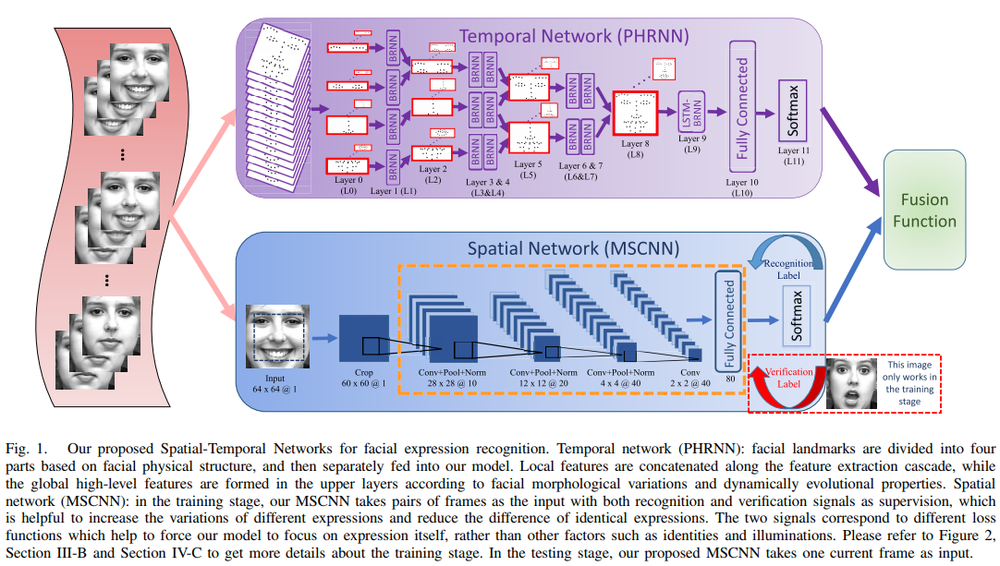
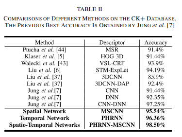
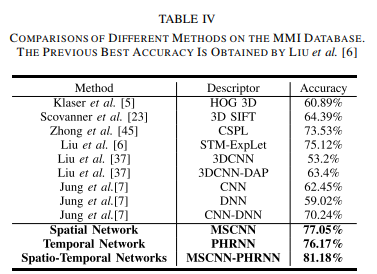
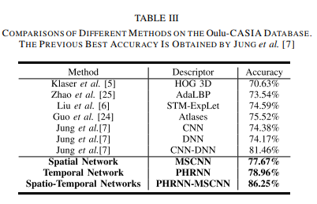

# Facial Expression Recognition Based on Deep Evolutional Spatial-Temporal Networks

### Authors
* Kaihao Zhang
* Yongzhen Huang
* Yong Du
* Liang Wang

# Principal Topics
* Fer on video (16 Frames) and images
* Two streamed neural networks
* BI-RNN  part-based hierarchical
* CNN network for frames
* Fusion funtion for final prediction

### Datasets
* CK+
* MMI
* OULU

# Resume
The Authors propose a two stream network composed by MSCNN (spatial feature extractor) and PHRNN (temporal feature extractor)
that MSCNN work with the apex image of video and extract the probabilities of expression in this frames. In other hand the PHRNN work with facial landmarks in time, and fractioned by important parts of face, creating a part-based hierarchical temporal feature extractor.

| Architecture |
| :------------- |
|  |

#### Results

| CK | MMI | OULU |
| :------------- | :------------- | :------------- |
|  |  |  |
