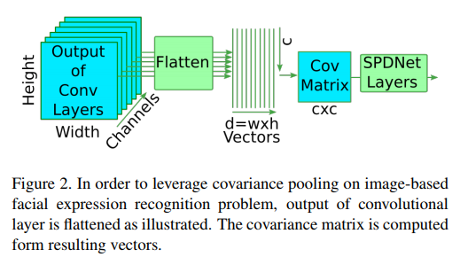
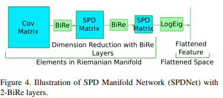
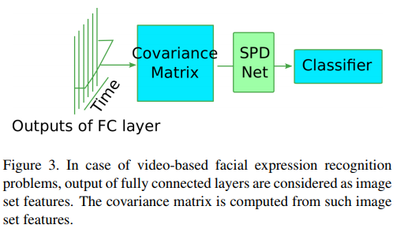
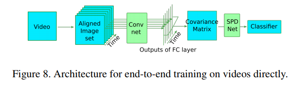
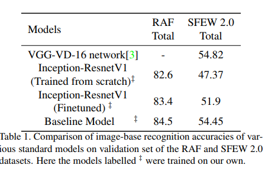
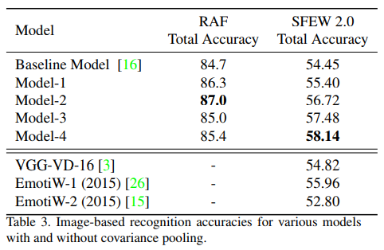
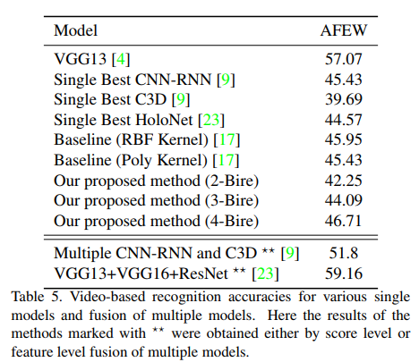

# Covariance Pooling for Facial Expression Recognition

### Authors
* Dinesh Acharya
* Zhiwu Huang
* Danda Pani Paudel
* Luc Van Gool

### Principal topics
* Fer on video and image
* Using convariance pooling and manifold neural layers
* SOTA results on images
* On video solution using transfer learning from image solution

### Datasets
* SFEW 2.0
* AFEW
* RAF

## Resume
the authors propose use the covariance pooling and manifold neural layers for solve problem in facial expression recognition, to do this they create two approach image-based and video-based.

The frame based is using a classic convolutional neural network for extract the features for frame and create a covariance matrix (covariance pooling) using each channels as a entry. The covariance matrix is used to feed a SPD network which is composed by:
* Bilinear Mapping layer (BiMap) as convs
* EigenValue Rectification (ReEig) as ReLU
* Log Eigenvalue Layer (Log Eigen) as dense layers
and the final is feeded into classifier.

| Covariance matrix creation | SPD Network     |
| :------------- | :------------- |
|  |  |

The video based use the same architecture of image based to extract features for each frames, after each frame is used as a entry to create a covariance matrix, after that the SPD Network is the same of the image based solution

| Covariance matrix creation | General view  |
| :------------- | :------------- |
|  |  |

### results
| Image based | Image based 2 |  Video based |
| :------------- | :------------- | :------------- |
|  |  | 
