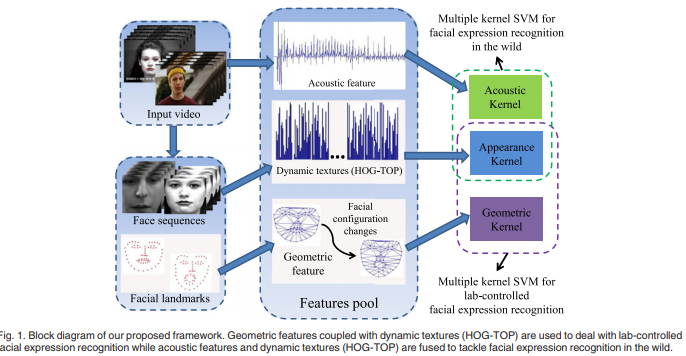
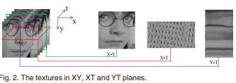
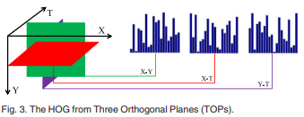
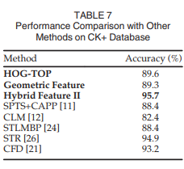
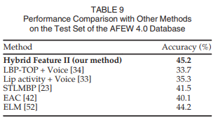

# Facial Expression Recognition in Video with Multiple Feature Fusion

### authors
* Junkai Chen
* Zenghai Chen
* Zheru Chi
* Hong Fu

### Principal topics
* Fer on video
* Classic machine Learning
* Mix audio, appearance and geometric features
* HOG-TOP same idea of LBP-TOP but with HOG
* SVM

### Datasets
* CK+
* AFEW

## Resume
Create two pipelines, the first is mixing sound, appearance features and geometric features and SVM to classify the Expression

| Pipeline |
| :------------- |
|  |

Inside of that pipeline it is the HOG-TOP feature extractor

| TOP | HOG-TOP |
| :------------- | :------------- |
|  |  |

### results

| CK+ | AFEW 4.0 |
| :------------- | :------------- |
|  |  |
