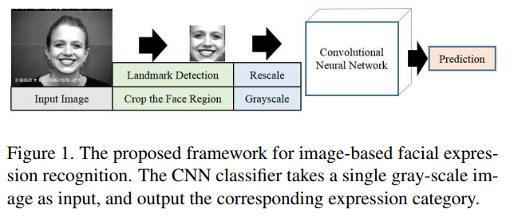
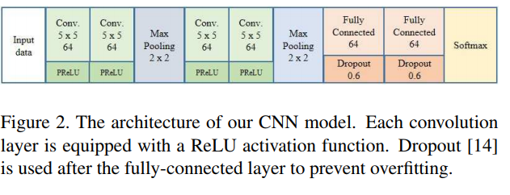
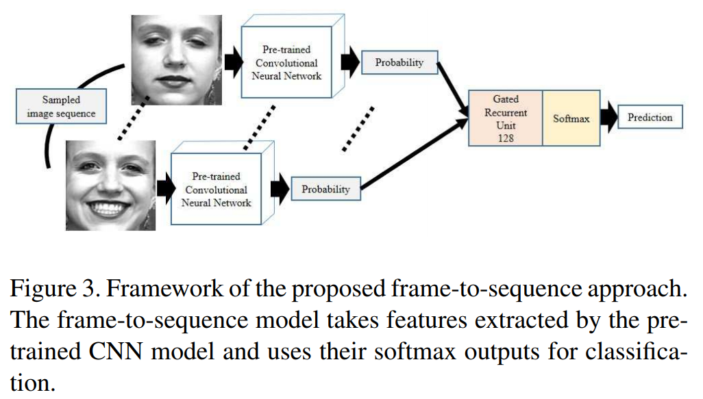
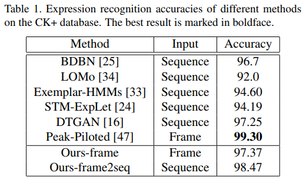
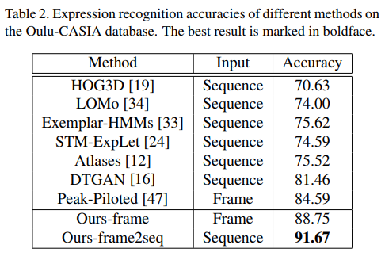
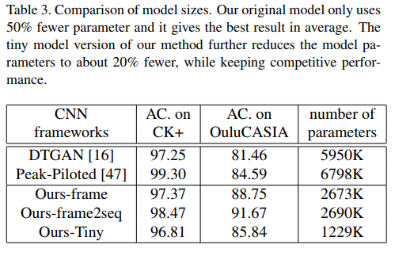

# A Compact Deep Learning Model for Robust Facial Expression Recognition

### authors
* Chieh-Ming Kuo
* Shang-Hong Lai
* Michel Sarkis

### Principal topics
* Fer on video and images
* Premiss that few parameters is better to FER in NN
* Create 4 CNN + 2 FC layers Network
* GRU

### Datasets
* CK+
* OULU

## Resume
The authors propose a new architecture (like mini-C3D with 2D) with 4 CNN layes and 2 FC layers to solve FER problem.

| Pipeline | Architecture     |
| :------------- | :------------- |
|  |  |

To solve the video based problem they propose extract the probabilities for each frame and use that probabilities to feed a GRU layer that create a final probability of Video

### results

| CK | OULU | Number of parameters |
| :------------- | :------------- | :------------- |
|    |   |  |
