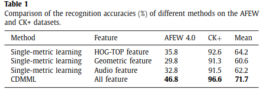
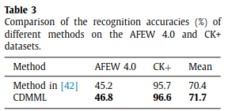

# Collaborative discriminative multi metric learning for facial expression recognition in video

### authors
* Haibin Yan

### principal topics
* FER on Video
* Classic machine Learning
* Multi-feature mixture for FER  (audio, appearance, geometric features)
* Multi metric Learning

### Datasets
* CK+
* AFEW 4.0

## Resume
The authors propose a multi metric learning pipeline mixturing different features from audio, appearance and geometric and train a multi metric for classify the different facial expressions

# results

| CK/AFEW | SOTA |
| :------------- | :------------- |
|    |   |
