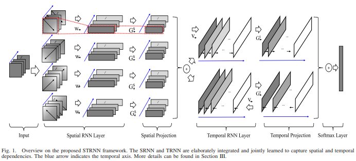
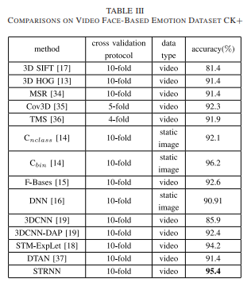

# Spatial–Temporal Recurrent Neural Network for Emotion Recognition

### authors
* Tong Zhang
* Wenming Zheng
* Zhen Cui
* Yuan Zong
* Yang Li

### Principal topics

### Datasets
* CK+

## Resume
The authors create a spatio-temporal end-to-end neural network based on two RNN modules, SRNN and TRNN named the new architecture STRNN.

| Architecture |
| :------------- |
|  |

### results

| CK+ |
| :------------- |
|  |
