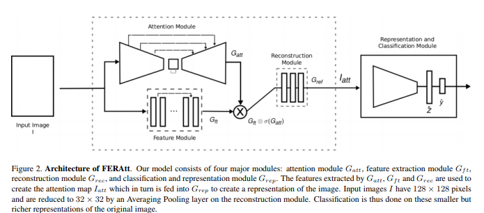
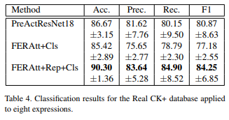
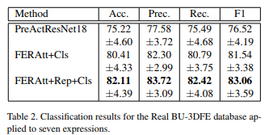

# FERAtt: Facial Expression Recognition with Attention Net

### Authors:
* Pedro D. Marrero Fernandez
* Fidel A. Guerrero Pena
* Tsang Ing Ren
* Alexandre Cunha

### Principal topics

* FER on Images
* Attention mechamism

# Datasets

* CK+
* BU3DFE

### Resume

A new end-to-end network architecture for facial expression recognition with an attention model. It focuses attention in the human face and uses a Gaussian space representation for expression recognition.

#### architecture

#### Results

| CK+     | BU3DFE     |
| :------------- | :------------- |
|     |      |
