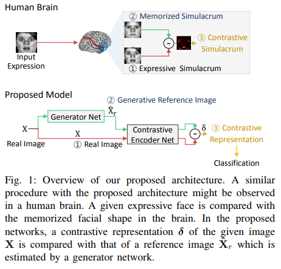

# Deep generative-contrastive networks for facial expression recognition

### Authors
* Youngsung Kim
* ByungIn Yoo
* Youngjun Kwak
* Changkyu Choi
* and Junmo Kim

# Principal Topics
* Fer on Images
* Encoder-Decoder used to classification
* 2DCNN
* Based in NeuroScience see `references`

### Datasets
* CK+
* MMI
* OULU-CASIA
* FER2013
* SFEW
* AFEW
* RAF

# Resume
The idea is based in psychologist and neuroscience, that say the human brain has a facial representation learned for each expression, to recognize what expression the brain is seeing they make a contrast between the learned representation and the input.

This paper based on that idea create a neural network mixture ideas from encoder-decoder and classification.

#### Architecture

#### Results
| Dataset | Results     |
| :------------- | :------------- |
| CK+       |  |
| MMI       |  |
| OULU-Casia   |  |
| Widl |  |

#### Important references

