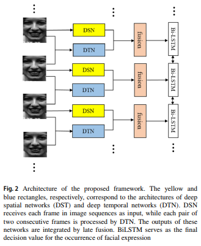
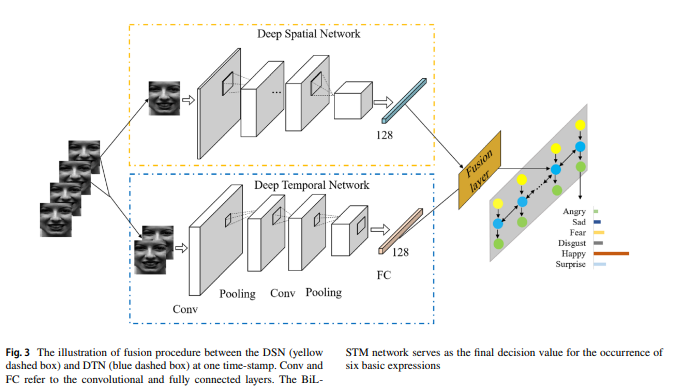
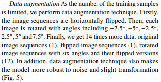
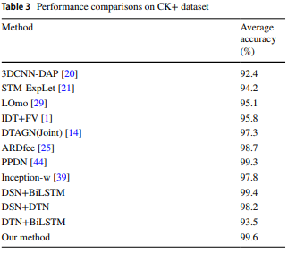
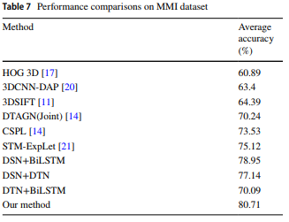
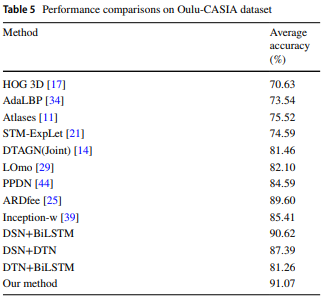

# Deep convolutional BiLSTM fusion network for facial expression recognition

### Authors
* Dandan Liang
* Huagang Liang
* Zhenbo Yu
* Yipu Zhang

### Prinpcipal Topics

* Fer on video **(N frames not provided)**
* Two merged networks
* SOTA Results
* RNN-BILSTM
* 2DCNN
* Classic data augmentation
* Transfer learning (ImageNet)

### Datasets
* CK
* OULU
* MMI

## Resume

The authors  present a novel framework that jointly learns spatial features and temporal
dynamics for FER.
Given the image sequence of an expression, spatial features are extracted from each frame using a deep network, while the temporal dynamics are modeled by a convolutional network, which takes a pair of consecutive frames as input. Finally, the framework accumulates clues from fused features by a BiLSTM network.

#### Architecture
<table>
  <tr>
    <td>
      
    </td>
    <td>
      
    </td>
  </tr>

#### Data augmentation

#### Results

| CK+ | MMI | OULU |
| :------------- | :------------- |  :------------- |
|   |  |  |
