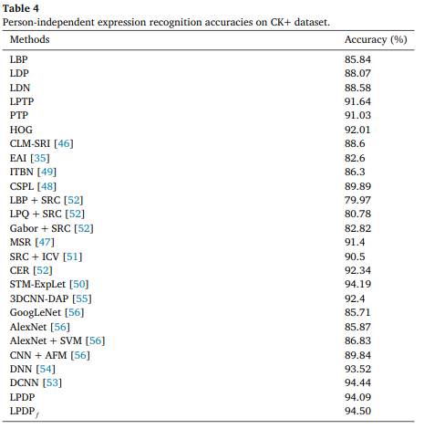
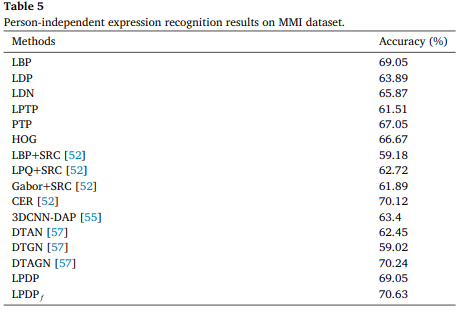
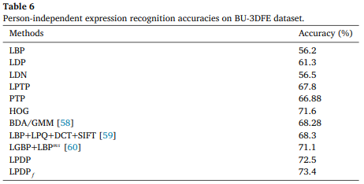
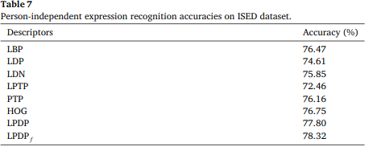
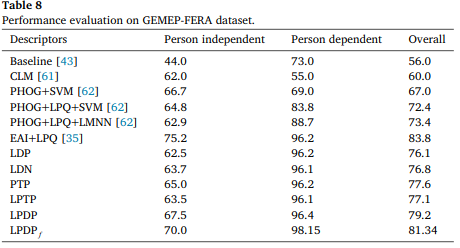
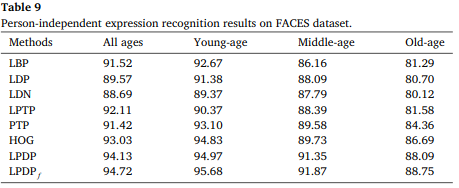

# Facial expression recognition with local prominent directional pattern

### authors
* Farkhod Makhmudkhujaeva
* M. Abdullah-Al-Wadudb
* Md Tauhid Bin Iqbala
* Byungyong Ryua,Oksam Chaea

### Principal Topics

* Fer on images **Compared with video results**
* Classic Machine learning
* improvment on LBP, LDP

### Datasets
* CK
* MMI
* BU-3DFE
* ISED
* GEMEP-FERA
* FACES

## Resume
propose novel edge-based descriptor, named Local Prominent Directional Pattern (LPDP), which considers statisticalinformation of a pixel neighborhood to encode more meaningful and reliable information than the existingdescriptors for feature extraction. More specifically, LPDP examines a local neighborhood of a pixel to retrievesignificant edges corresponding to the local shape and thereby ensures encoding edge information in spite ofsome positional variations and avoiding noisy edges. Thus LPDP can represent important textured regions mucheffectively to be used in facial expression recognition.

#### Results
| Dataset | Experiments     |
| :------------- | :------------- |
| CK+ |  |
| MMI |  |
| BU-3DFE |  |
| ISED |  |
| GEMEP-FERA |  |
| FACES |  |
