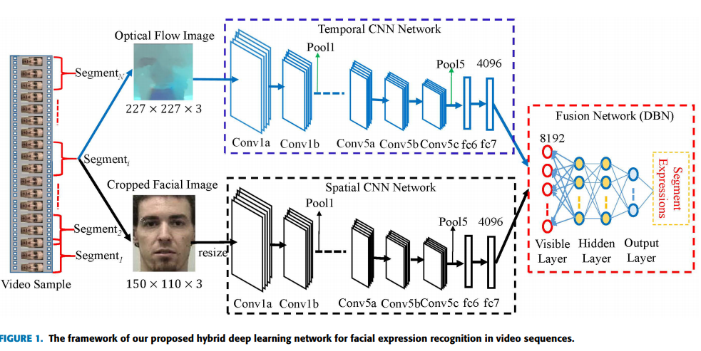
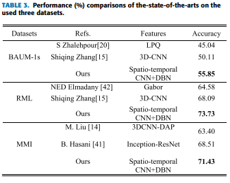

# Learning Affective Video Features for Facial Expression Recognition via Hybrid Deep Learning
### Authors
* SHIQING ZHANG
* XIANZHANG PAN
* YUELI CUI
* XIAOMING ZHAO
* AND LIMEI LIU

### Prinpcipal Topics
* FER on Video **(`16` frames used)**
* Two merged networks
* Hybrid method (CNN + DBN + SVM)
* 2DCNN
* Optical Flow
* Transfer learning (VGG16, IMAGENET)
* Data augmentation dividing each video in N segments of 16 frames

### Datasets
* BAUM-1s
* RML
* MMI

# Resume
Divide de video in segment of size `16` and for each segment calculate the optical flow and feed the temporal CNN network at the same time using one image in the segment feed the spatial CNN Network. The features extracted in each feature extractors add feeded into Deep belief network that performs the classification.

#### Architecture

#### Results

